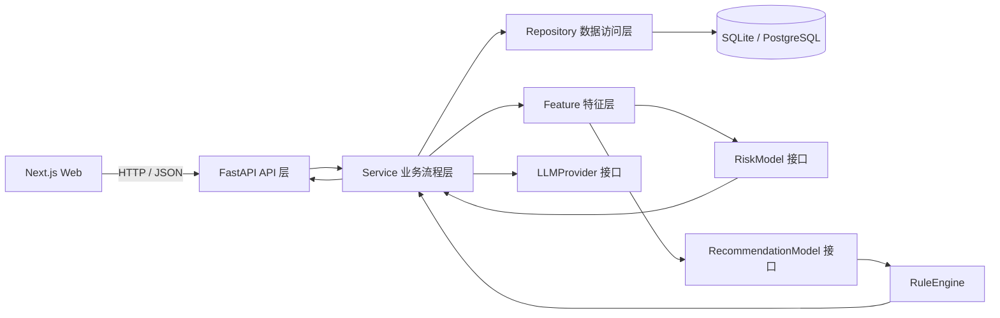
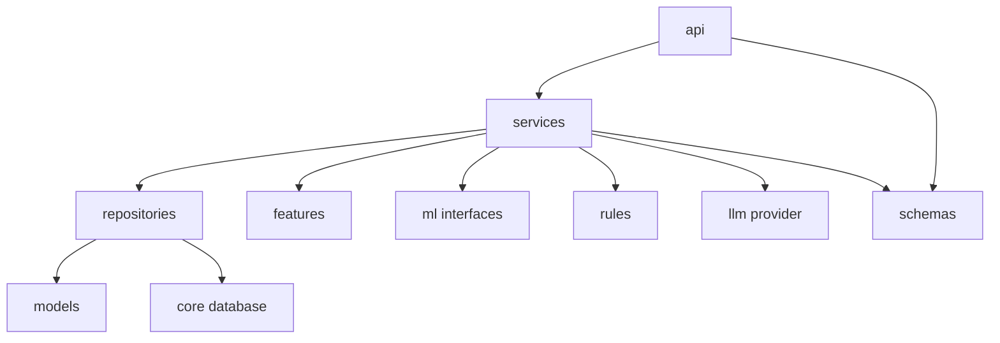

# 循影定检系统架构

2026-09-16：本文保留已有模块结构及阶段历史。未来实现目标与验收以 [实施设计](docs/IMPLEMENTATION_DESIGN.md) 为准；文中的阶段编号不等于项目整体完成度。

## 1. 架构目标与边界

循影定检的核心任务是基于受检者历年体检数据和纵向影像病灶变化预测健康风险，并辅助决定下一次最值得进行的体检项目。系统不是“上传报告后让大模型自由总结”的应用。

当前已有 Patient × ExamItem 的 DeepFM 匹配排序、候选生成、评估、模型制品和独立规则引擎。DeepFM 输出仍不是最终方案，尚需完整业务编排与方案生成。LightGBM 实现与真实数据实验尚未完成；现有合成数据测试不代表模型有效性。

系统定位始终是“体检项目辅助推荐和健康数据辅助分析”，不提供确定疾病诊断、医疗处方或治疗建议，也不替代医生。

## 2. 系统总体架构



后端采用分层架构。API 层只处理 HTTP 协议、参数验证和响应映射；Service 层编排业务流程；Repository 层隔离数据库访问；Feature、ML、Rules、LLM 分别承载特征、模型、规则和语言模型职责。

## 3. 核心数据流

```text
患者历年体检数据
→ 数据标准化
→ 纵向指标分析
→ 影像病灶跨年匹配
→ LightGBM 风险预测
→ DeepFM Patient × ExamItem 项目匹配
→ Rule Engine 安全约束与排序修正
→ 精简 / 标准 / 深入三档体检方案
→ 可解释推荐
→ LLM 自然语言解释与问答
```

关键约束：LLM 只接收经过授权且结构化的上下文与模型结果，不能读取原始报告后自行决定体检项目。最终推荐必须保留模型排序和规则调整的双重追踪信息。

## 4. 前端职责

前端负责信息展示、用户交互、输入校验、可访问性和调用后端，不负责医疗规则或机器学习计算。

| 页面 | 规划职责 |
| --- | --- |
| `/dashboard` | 产品流程、待处理事项和系统状态总览 |
| `/patients` | 受检者列表与检索入口 |
| `/patients/[id]` | 单个受检者纵向健康档案 |
| `/health-records` | 历年体检记录与标准化状态 |
| `/imaging` | 影像检查和病灶跨年匹配结果 |
| `/trends` | 纵向指标趋势可视化 |
| `/risk-analysis` | 风险输出、特征贡献和模型版本 |
| `/recommendations` | 三档方案列表与生成状态 |
| `/recommendations/[id]` | 推荐、排除和规则调整的详细证据 |
| `/ai-report` | 基于结构化结果的健康说明 |
| `/ai-chat` | 受控患者上下文问答 |
| `/admin/exam-items` | 体检项目目录维护 |
| `/admin/medical-rules` | 医疗规则版本与状态维护 |
| `/admin/models` | 模型、特征流水线和评估版本管理 |
| `/demo` | 明确标记的演示入口 |

`frontend/services` 统一封装 HTTP 调用，`frontend/types` 放置前后端共享概念的 TypeScript 表达，React 页面只组合视图与交互。

## 5. 后端职责

```text
backend/app/
├── api/           HTTP 路由、依赖注入、请求和响应协议
├── models/        SQLAlchemy 持久化模型
├── schemas/       Pydantic 输入输出契约
├── repositories/  数据访问实现
├── services/      业务用例与跨模块流程编排
├── features/      标准化后特征计算与特征版本管理
├── ml/            模型接口及未来模型适配器
├── rules/         医疗规则接口、决策类型和规则编排
├── llm/           LLM Provider 接口及未来供应商适配器
└── core/          配置、数据库和横切基础设施
```

依赖方向遵循：`api → services → repositories/features/ml/rules/llm`。底层模块不得反向导入 API；数据库模型不承载业务流程；Repository 不做医疗判断；API Controller 不写模型逻辑。

## 6. 机器学习职责

### RiskModel

`RiskModel` 是风险预测适配缝隙，预留以下接口：

- `train()`：训练风险模型；
- `predict()`：输出结构化风险概率与追踪字段；
- `evaluate()`：计算并返回真实评估结果；
- `load()`：加载指定版本模型；
- `save()`：保存模型及元数据。

未来 LightGBM 适配器只能实现此职责，不能生成体检项目最终推荐。

### RecommendationModel

`RecommendationModel` 是 Patient × ExamItem 匹配适配缝隙，提供：

- `train()`；
- `rank()`；
- `evaluate()`；
- `load()`；
- `save()`。

当前 `DeepFMRecommendationModel` 是真实 PyTorch Adapter，由共享 embedding 的线性项、FM 二阶交互和 Deep MLP 组成，输出 sigmoid 约束的 `deepfm_score`。Candidate Generator 只构建高召回项目集合，不执行安全过滤；评分必须继续经过 Rule Engine，不能直接作为最终方案。未知项目和类别使用 field 级 UNK，制品保存权重、embedding 配置、特征映射和全部版本。

模型输出必须携带或可关联：`feature_pipeline_version`、`risk_model_version`、`recommendation_model_version`、输入证据引用和推理运行标识。没有真实训练和评估，不得展示为模型实验结果。

## 7. 规则引擎职责

`RuleEngine.evaluate(patient, item)` 接收 `PatientContext` 与 `CandidateExamItem`，返回 `RuleDecision[]`。每个决定包含规则代码、规则版本、动作、原因和证据引用。

未来规则可执行：复查间隔、功能重复、辐射暴露、年龄、性别、资料不足和人工复核等约束。规则引擎可以排除项目、要求复核或调整模型排序，但第一阶段没有内置任何医疗规则。

规则执行顺序、冲突合并策略、规则版本和最终方案生成策略需要在后续阶段单独设计和测试。

## 8. LLM 职责

`LLMProvider` 只暴露三个任务接口：

- `generate_health_summary()`；
- `explain_recommendation()`；
- `chat_with_patient_context()`。

Provider 输入是由业务流程构造的结构化上下文，不是未经处理的原始体检报告。LLM 输出属于自然语言解释层，不得覆盖模型评分、规则决策或最终推荐结果。所有响应应记录 `llm_model`，并预留内容安全、审计和脱敏机制。

## 9. 模块依赖与调用原则



- 具体模型、规则和 LLM 供应商作为 Adapter 注入 Service，而不是在调用处创建。
- 核心接口同时作为调用面和测试面，测试通过假 Adapter 验证流程，不通过写死生产结果绕过实现。
- 当前 ML、规则执行和 LLM 仍只有接口与无医疗含义的编排外壳。出现真实实现前，不增加虚假输出。
- ECharts 只负责趋势和解释性图表；图表数据由后端结构化输出提供，前端不得计算医疗结论。

## 10. 可追溯性与版本

后续核心输出至少需要关联：

| 字段 | 作用 |
| --- | --- |
| `feature_pipeline_version` | 标准化与特征计算版本 |
| `risk_model_version` | 风险模型版本 |
| `recommendation_model_version` | 项目匹配模型版本 |
| `rule_version` | 规则集或单条规则版本 |
| `llm_model` | 解释所用语言模型 |
| `evidence_refs` | 历史记录、指标、影像或规则证据引用 |
| `trace_id` | 一次处理或推理运行标识 |

推荐详情未来必须同时回答：推荐依据、未推荐原因、特征影响、规则对排序的修改，以及使用的全部版本。

## 11. 数据库与迁移

开发环境使用 SQLite，生产设计兼容 PostgreSQL。SQLAlchemy 2.x 负责 ORM，Alembic 负责唯一的 Schema 迁移路径。应用启动不调用 `create_all()` 静默改库；任何业务表都应通过版本化迁移创建。

第二阶段已通过初始迁移建立患者、体检批次、指标字典与观测、影像检查与病灶、病灶轨迹与观察、项目目录与已检历史，以及风险、推荐和 AI 输出容器。应用启动不自动建表；新环境先执行 `python -m alembic upgrade head`。

体检批次是实验室指标、影像检查和已检项目的共同时间锚点。原始指标名/值/单位与标准化结果并存，防止标准化覆盖来源证据。单次病灶与跨年病灶轨迹是两个独立身份；本阶段术语映射不会自动创建跨年匹配。

基础 CRUD 遵循 `API → Service → Repository → SQLAlchemy Model`。API 负责协议和错误映射，Service 管理事务，Repository 只做数据库操作。风险、推荐和 AI 表仅用于约束未来可追溯输出，本阶段 Seed 保持为空。

第三阶段病灶分析遵循 `API → LesionAnalysisService → lesion features`：`terminology` 统一结构化术语，`scorer` 输出组件分数和原因，`matcher` 执行批次级一对一分配与阈值决策，`trend` 计算已归轨观察的描述性变化。`NEED_REVIEW` 只保存候选轨迹，不能形成自动匹配身份；检查范围不完整时不得将未出现病灶判为消失。详细契约见 `LESION_MATCHING.md`。

第四阶段指标特征采用纯计算边界 `FeaturePipeline.build(PatientFeatureRequest) → PatientFeatureVector`。流水线按指标分组，使用实际日期计算统计、线性回归斜率、首尾变化、波动系数和方向一致性，并形成 `RISING / FALLING / STABLE / FLUCTUATING`；证据不足时显式返回 `UNKNOWN`。Early Warning 只描述参考区间内连续接近界限的模式。输出同时保留指标解释对象、系统级分组、数值特征字典、稳定顺序、证据引用和 `feature_pipeline_version`。Repository/Service 未来负责 ORM 映射，Feature 层不依赖数据库或 ML 框架。详细契约见 `FEATURE_ENGINEERING.md`。

第六阶段推荐排序遵循 `API → RecommendationRankingService → CandidateGenerator → RecommendationModel`。模型输入包含人口学、历史项目、当前指标、纵向趋势、病灶变化、版本化风险概率、置信度、时间间隔和项目属性；患者身份本身不进入模型。API 未加载制品时返回 503，成功响应明确标记 `requires_rule_engine=true` 和非疾病概率语义。完整契约与偏差审计见 `RECOMMENDATION_MODEL.md`。

## 12. 未来扩展点

- 体检报告导入 Adapter：结构化表格、OCR 或医院接口；
- 数据标准化与单位换算流水线；
- 固定训练指标目录、特征列 Schema 和版本化缺失填补策略；
- 影像病灶实体及跨年匹配策略；
- LightGBM 训练、校准、解释与模型注册；
- DeepFM 真实标签治理、负样本/删失策略、时间外评估、公平性与候选 Recall 监控；
- 医疗规则 DSL、冲突处理、灰度版本和审计；
- 三档方案的预算、覆盖度与冗余控制；
- LLM 供应商 Adapter、脱敏、内容安全和提示版本；
- 鉴权、权限分级、操作审计和隐私合规；
- PostgreSQL、对象存储、任务队列和可观测性；
- 医务人员确认、驳回和修改闭环。

这些扩展必须按阶段引入，并以真实实现、测试和可追溯数据为完成依据。
